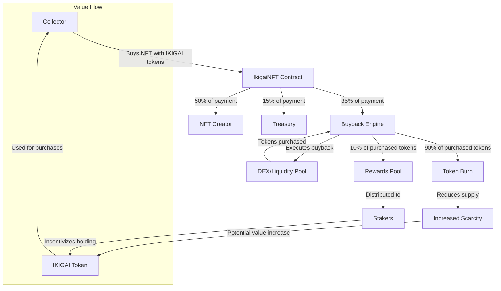

# Ikigai Protocol

A comprehensive NFT marketplace and reward system on BeraChain, featuring dynamic rewards, trading incentives, and automated liquidity management.

## Core Features

### NFT Marketplace (via Reservoir)
- Seamless trading experience
- Priority minting for BeraChain NFT holders
- Automated reward distribution
- Transparent fee structure

### Dynamic Reward System
1. **Trading Rewards**
   - Base reward: 3% in IKIGAI tokens
   - Combo multipliers (up to 5x)
   - 24-hour combo window
   - Volume-based milestones

2. **Minting Rewards**
   - 5% reward for minting NFTs
   - Priority minting discounts
   - BeraChain NFT holder benefits
   - Minting rewards vesting:
     - 3 month linear vesting
     - 1 week cliff period
     - Claimable in portions
     - Transparent tracking

3. **Staking Rewards**
   - 2% base staking reward
   - Tiered multipliers
   - Lock period bonuses
   - Compound rewards

4. **Referral Program**
   - 1% referral rewards
   - Unlimited referrals
   - Instant distribution
   - Transparent tracking

### Reward Mechanics

#### Trading Combos
- Each trade within 24h increases combo
- 0.1% bonus per combo level
- Maximum 5x multiplier
- Auto-reset after 24h inactivity

#### Volume Milestones
- Level 1: 10 BERA = 5 IKIGAI
- Level 2: 100 BERA = 50 IKIGAI
- Level 3: 500 BERA = 400 IKIGAI
- Level 4: 1000 BERA = 1000 IKIGAI

#### Staking Tiers
- Base: 1x rewards
- Silver: 1.25x rewards
- Gold: 1.5x rewards
- Diamond: 2x rewards

## Technical Integration

### Smart Contracts
- `IkigaiToken.sol`: ERC20 token with marketplace and deflationary features
- `IkigaiNFT.sol`: NFT contract with staking and reward distribution

### Reservoir Integration
```typescript
// Example usage
const reservoir = new ReservoirSDK({
    apiKey: RESERVOIR_API_KEY,
    chainId: 1 // BeraChain
});

// Listen for sales
reservoir.sales.subscribe((sale) => {
    // Reward distribution
});
```

### Fee Structure
Total: 4.3% of transactions
- 2% Protocol Owned Liquidity
- 1.3% Staking Rewards
- 1% Treasury Operations

## Development

### Prerequisites
- Node.js v23
- Hardhat
- Foundry (optional)

### Setup
```bash
# Install dependencies
yarn install

# Compile contracts
yarn contracts:compile

# Run tests
yarn contracts:test
```

### Deployment
```bash
# Deploy to BeraChain
yarn contracts:deploy:berachain
```

## Security Features & Architecture

### Core Security Mechanisms

1. Access Control Layers
```solidity
// Example implementation
modifier onlyWhitelisted() {
    require(whitelisted[msg.sender], "Not whitelisted");
    _;
}
```
- Role-based permissions (Owner, Strategist, Rebalancer)
- Whitelist system for critical operations
- Granular function access control
- Multi-signature support for critical functions

2. Rate Limiting
```solidity
struct RateLimit {
    uint256 lastActionTime;
    uint256 actionCount;
    uint256 windowStart;
}
```
- Per-action cooldowns
- Maximum actions per time window
- Graduated limits based on user tier
- Anti-spam protection

3. Circuit Breakers
```solidity
bool public emergencyMode;
uint256 public lastEmergencyAction;
uint256 public constant EMERGENCY_TIMEOUT = 24 hours;
```
- Emergency pause functionality
- Tiered shutdown mechanisms
- Automatic suspension triggers
- Recovery timeouts

4. Transaction Guards
```solidity
modifier validAmount(uint256 amount) {
    require(amount > 0 && amount <= MAX_SINGLE_TRANSFER, "Invalid amount");
    _;
}
```
- Maximum transaction limits
- Slippage protection
- Price impact checks
- Balance/allowance validation

### Security Features by Contract

#### IkigaiToken
- Adaptive burn rate based on market cap
- Transfer limits and cooldowns
- Contract interaction restrictions
- Liquidity protection mechanisms

#### IkigaiNFT
- Stake amount validation
- Rate-limited minting
- Tiered access control
- Emergency withdrawal system

#### IkigaiMarketplace
- Price validation
- Royalty limits
- Auction safety checks
- Batch operation limits

#### IkigaiRewards
- Reward calculation safety
- Distribution rate limits
- Combo system protection
- Vesting schedule security

#### IkigaiTreasury
- Rebalancing thresholds
- Liquidity ratio protection
- Fee distribution safety
- Emergency recovery system

### Protection Mechanisms

1. Value Protection
```solidity
uint256 private constant MAX_PRICE = 1_000_000 * 1e18; // 1M BERA max
uint256 private constant MIN_LIQUIDITY = 1000 * 1e18;  // 1000 BERA min
```
- Maximum value caps
- Minimum threshold requirements
- Value relationship checks
- Overflow protection

2. Time Protection
```solidity
uint256 public constant ACTION_COOLDOWN = 1 hours;
uint256 public constant MIN_REBALANCE_INTERVAL = 1 days;
```
- Action cooldowns
- Minimum intervals
- Maximum durations
- Timestamp validation

3. State Protection
```solidity
mapping(address => bool) public blacklisted;
mapping(address => uint256) public lastActionTime;
```
- State machine validation
- Reentrancy guards
- Operation ordering
- State transition checks

4. Asset Protection
```solidity
function emergencyWithdraw() external nonReentrant notBlacklisted(msg.sender) {
    require(emergencyMode, "Not in emergency mode");
    // ... safe withdrawal logic
}
```
- Safe transfer patterns
- Return value checking
- Balance validation
- Emergency recovery

### Security Events & Monitoring

1. Security Events
```solidity
event SecurityIncident(
    address indexed account,
    string incidentType,
    uint256 timestamp
);
```
- Security incident logging
- Rate limit violations
- Emergency mode changes
- Critical state updates

2. Monitoring Hooks
```solidity
event SecurityLimitExceeded(
    address indexed account,
    string limitType,
    uint256 amount,
    uint256 limit
);
```
- Transaction monitoring
- Rate limit tracking
- Value threshold alerts
- State change notifications

### Emergency Procedures

1. Emergency Mode
```solidity
function enableEmergencyMode() external onlyOwner {
    emergencyMode = true;
    lastEmergencyAction = block.timestamp;
    emit EmergencyModeEnabled(block.timestamp);
}
```
- Activation conditions
- Cooldown periods
- Recovery procedures
- Asset protection

2. Recovery Functions
```solidity
function emergencyWithdraw(
    address token,
    address recipient,
    uint256 amount
) external onlyOwner {
    require(emergencyMode, "Not in emergency");
    // ... safe withdrawal logic
}
```
- Asset recovery
- State reset
- Access restoration
- System restoration

### Security Best Practices

1. Code Patterns
- Check-Effects-Interaction pattern
- Pull over push payments
- Secure function ordering
- Safe math operations

2. Testing Requirements
- Comprehensive unit tests
- Integration testing
- Fuzzing/property testing
- Security scenario testing

3. Deployment Process
- Multi-signature deployment
- Gradual rollout
- Emergency contacts
- Incident response plan

4. Maintenance
- Regular audits
- Upgrade procedures
- Bug bounty program
- Security monitoring

## Support & Documentation

- [Reservoir Docs](https://docs.reservoir.tools/)
- [BeraChain Docs](https://docs.berachain.com/)
- [Technical Docs](./docs/TECHNICAL.md)
- [API Reference](./docs/API.md)

## License

MIT License

## Tokenomics

### IKIGAI Token Overview
- **Token Standard**: ERC20
- **Symbol**: IKIGAI
- **Maximum Supply**: 1,000,000,000 (1 billion)
- **Initial Supply**: 0 (fair launch)
- **Decimals**: 18

### NFT Collections
- **Genesis Series**
  - Mint with BERA
  - Get IKIGAI rewards (vested over 90 days with 7-day cliff)
  - Priority access for BeraChain NFT holders
  - Whitelist support with discounts

- **Post-Genesis Series**
  - Mint with IKIGAI tokens
  - 35% to buyback (90% burned, 10% to rewards)
  - 50% to creators
  - 15% to treasury
  - Staking Requirements:
    - Minimum stake amount required (5,000 IKIGAI)
    - Lock duration requirements (7+ days)
    - Tier-based discounts:
      - 5,000 IKIGAI staked = 10% off mint price
      - 10,000 IKIGAI staked = 20% off mint price
      - 25,000 IKIGAI staked = 30% off mint price
    - Whitelist benefits (additional 5% discount)

### Minting Mechanics
**Staking Discounts**:
- 5,000 IKIGAI staked = 10% off mint price
- 10,000 IKIGAI staked = 20% off mint price
- 25,000 IKIGAI staked = 30% off mint price

**Whitelist Benefits**:
- Early access to new series
- Additional price discounts
- Guaranteed mint slots
- Combinable with staking discounts

**Series Requirements**:
- Genesis: Pay in BERA, get vested IKIGAI
- Series 1+: Requires IKIGAI stake
- Higher series = higher stake requirements
- Longer stake duration = better benefits

### Token Distribution & Emissions
**Initial Distribution**:
- 0% Team/Advisors (no pre-mine)
- 0% Private Sale
- 100% through protocol activities

**Emission Schedule**:
- Year 1: Maximum 250M tokens (25%)
- Year 2: Maximum 200M tokens (20%)
- Year 3: Maximum 150M tokens (15%)
- Year 4+: Determined by protocol activity

**Emission Sources**:
- Trading Volume (40% of emissions)
- NFT Minting (30% of emissions)
- Staking Rewards (20% of emissions)
- Referrals & Combos (10% of emissions)

### Advanced Reward Mechanisms
**Dynamic Reward Calculation**:
- Market Activity Multiplier:
  - 1.5x when daily volume > 1000 BERA
  - Automatically adjusts based on activity
  - Encourages active trading periods

- User Performance Multipliers:
  - Trade Streak: +15% per day (max 100%)
  - Staking Duration: Up to 50% bonus
  - Monthly Volume: Up to 100% bonus
  - Compounds with other bonuses

- Combined Multipliers:
  - Base Reward × Market Multiplier
  - + Streak Bonus
  - + Staking Duration Bonus
  - + Volume Tier Bonus
  - Final reward can be up to 4x base

### Dynamic Fee Structure
**Base Fees**: 4.3% total
**Reductions Based On**:
- Staking tier (up to -30%)
- Trading volume (up to -20%)
- Loyalty streak (up to -15%)
- Combined max reduction: 50%

### Protocol Revenue
**Fee Distribution**:
- 40% Buy & Burn
- 30% Staking Rewards
- 20% Treasury
- 10% Development

**Seasonal Allocations**:
- 5% to seasonal rewards
- 3% to NFT rewards
- 2% to boost pool
- Remainder to standard distribution

### Supply Control Mechanisms
**Adaptive Burn Rate**:
- Base: 1% of transactions
- Scales with market cap
- Dynamic adjustment
- Maximum 4% at peak

**Supply Caps**:
- Daily mint limit: 0.1% of supply
- Weekly emission cap: 0.5% of supply
- Monthly maximum: 2% of supply

**Emission Safeguards**:
- Rolling caps
- Market-based adjustments
- Volume-based scaling
- Emergency limits

### Token Utility
**Minting Access**:
- Required for post-genesis series
- Higher stakes = better discounts
- Longer stakes = more benefits

**Governance**:
- Series parameters
- Reward rates
- Protocol fees
- Treasury management

**Staking Benefits**:
- Mint discounts
- Trading fee reductions
- Priority access
- Enhanced rewards

### Trading Controls
- **Transfer Limits**:
  - Maximum transfer: 1M IKIGAI per transaction
  - Cooldown period: 1 minute between transfers
  - Batch limit: 20 operations

- **Anti-Bot Protection**:
  - Trading enabled gradually
  - Transfer cooldowns
  - Blacklist system
  - Rate limiting

### Staking Mechanism
- **Lock Periods**:
  - Base Tier: 1 week
  - Silver: 2 weeks
  - Gold: 3 weeks
  - Diamond: 4 weeks

- **Minimum Stakes**:
  - Base: 1,000 IKIGAI
  - Silver: 5,000 IKIGAI
  - Gold: 10,000 IKIGAI
  - Diamond: 25,000 IKIGAI

### Treasury Operations
- **Protocol Owned Liquidity**:
  - 2% of all fees to POL
  - Dynamic rebalancing
  - Minimum liquidity thresholds
  - Automated LP management

- **Revenue Distribution**:
  - 50% to staking rewards
  - 30% to liquidity
  - 20% to treasury operations

### Security Features
- **Trading Controls**:
  - Configurable limits
  - Emergency pause
  - Blacklist system
  - Rate limiting

- **Access Control**:
  - Role-based permissions
  - Multi-sig treasury
  - Time-locked upgrades
  - Emergency controls

### Reward Distribution
**Seasonal Structure**:
- Regular seasons (30-120 days)
- Special events/holidays
- Competitive leaderboards
- Exclusive NFT rewards

**Point System**:
- Trading volume (base points)
- Loyalty multipliers
- Staking bonuses
- Seasonal boosts

**Special Events**:
- Holiday themes
- Flash events
- Community challenges
- Bonus periods

### Emission Controls
**Dynamic Limits**:
- Daily: 0.1% of supply
- Weekly: 0.5% of supply
- Monthly: 2% of supply

**Event Adjustments**:
- Event boost periods
- Holiday multipliers
- Special mint windows
- Dynamic caps

### Supply Control
**Adaptive Mechanics**:
- Market cap scaling
- Volume-based limits
- Emergency controls

**Event Controls**:
- Event-specific caps
- Boosted period limits
- Special event reserves
- Holiday allocations

## Contract Structure

### Core Contracts
- `IkigaiToken.sol`: ERC20 token with marketplace and deflationary features
- `IkigaiNFT.sol`: NFT contract with staking and reward distribution

### Marketplace Contracts
- `IkigaiMarketplace.sol`: NFT marketplace operations
- `IkigaiController.sol`: Marketplace control and configuration

### Reward System
- `IkigaiRewards.sol`: Handles reward distribution from marketplace sales

### Treasury Management
- `IkigaiTreasury.sol`: Protocol treasury and liquidity management

### Libraries
- `Constants.sol`: Shared constants
- `Types.sol`: Common types and structures

# Buyback System

## Overview
The Ikigai Protocol implements an advanced automated buyback system with dynamic pressure mechanics and strategic token burns, enhancing token value and market stability.

## Core Mechanics

### Revenue Collection
| Source | Allocation | Description |
|--------|------------|-------------|
| Trading Fees | 30% | From all trading activity |
| NFT Sales | 35% | Primary and secondary sales |
| Treasury Yield | 25% | From treasury investments |
| Transfer Tax | 2-5% | Tiered based on amount |
| Staking Fees | 25% | From staking operations |

### Distribution
- **90% Burn Rate**: Increased burn ratio for stronger deflation
- **10% Rewards**: Reduced rewards allocation
- **30% Reserve**: Long-term stability buffer
- **10% Bull Market**: Reserved for above $1.00 buybacks

### Safety Parameters
```solidity
struct SafetyLimits {
    uint256 cooldown: 12 hours,        // Reduced cooldown
    uint256 emergencyThreshold: 20%,   // Price drop trigger
    uint256 minLiquidity: 1%,          // Of market cap
    uint256 maxImpact: 2%,            // Per depth level
    uint256 depthRatio: 50%           // Minimum required
}
```

### Transfer Tax Tiers
| Amount | Tax Rate |
|--------|----------|
| <100K  | 2% |
| 100K-500K | 3% |
| >500K | 5% |

## Smart Execution

### Liquidity Analysis
```typescript
const DEPTH_ANALYSIS = {
  steps: 5,
  minDepth: 1000e18,  // $1M
  maxImpact: 200,     // 2%
  depthRatio: 5000    // 50%
}
```

### Execution Flow
1. **Revenue Collection**
   - Multiple sources feed buyback pool
   - Automatic allocation tracking
   - Accumulation until threshold met

2. **Market Analysis**
   - Price-based pressure calculation
   - Liquidity depth assessment
   - Impact prediction
   - Optimal size determination

3. **Execution**
   - Smart contract triggers
   - Slippage protection
   - Token purchase
   - Token distribution

## Contract Integration

### Core Interfaces
```solidity
interface IBuybackEngine {
    function collectRevenue(bytes32 source, uint256 amount) external;
    function executeBuyback() external;
    function emergencyBuyback() external;
    function calculatePressure(uint256 price) external view returns (uint256);
    function getCurrentPrice() external view returns (uint256);
    function BULL_PRICE_THRESHOLD() external view returns (uint256);
    function emergencyMode() external view returns (bool);
}
```

### Contract Parameters
```solidity
// V2 Token
uint256 public constant BUYBACK_TAX = 100; // 1% tax
uint256 public constant MIN_BUYBACK_AMOUNT = 1000e18;

// StakingV2
uint256 public constant STAKING_BUYBACK_SHARE = 2500; // 25%

// RewardsV2
uint256 public constant TRADING_BUYBACK_SHARE = 3000; // 30%

// TreasuryV2
uint256 public constant BUYBACK_SHARE = 2500; // 25%
```

## Safety Features

### Circuit Breakers
- Price-based triggers
- Volume anomaly detection
- Liquidity protection
- Manual override capability
- Emergency mode activation

### Recovery Procedures
- System pause functionality
- Fund recovery mechanisms
- State reset capabilities
- Emergency fund protection
- Fee exemption for critical contracts

## Monitoring

### Key Metrics
- Accumulated funds
- Last buyback time
- Revenue stream stats
- Liquidity depth analysis
- Price impact measurements
- Price history tracking

### Events
```solidity
event BuybackExecuted(
    uint256 amount,
    uint256 tokensBought,
    uint256 tokensBurned,
    uint256 tokensToRewards
);

event RevenueCollected(
    bytes32 indexed source,
    uint256 amount,
    uint256 buybackAllocation
);

event EmergencyModeChanged(bool mode);
event TokensRecovered(address token, uint256 amount);
event PriceRecorded(uint256 price, uint256 timestamp);
```

## Performance Optimization

### Gas Efficiency
- Batched operations
- Optimized state updates
- Minimal external calls
- Strategic execution timing

### Market Impact
- Smart order sizing
- Liquidity analysis
- Impact minimization
- Execution splitting
- Adaptive minimum liquidity

## Emergency Response

### Price Drop Protection
- 20% drop triggers emergency buyback
- Cooldown bypass for rapid response
- Reduced buyback share during emergencies
- Automatic price recording

### Adaptive Distribution
- Market condition-based allocation
- Increased buyback in bear markets
- Bull market reserve activation
- Dynamic tax tiers

## Security Measures

### Access Control
- Role-based permissions
- Multi-signature requirements
- Emergency-only functions
- Fee exemption whitelist

### Token Recovery
- Emergency token recovery
- Protected staked tokens
- Admin-only access
- Paused-state requirement

## Deployment Process

1. Deploy BuybackEngine with price feed
2. Deploy V2 token with tiered tax
3. Deploy StakingV2 with fee exemption
4. Deploy RewardsV2 with emergency distribution
5. Deploy TreasuryV2 with adaptive allocation
6. Configure all contracts with proper roles
7. Whitelist critical contracts for fee exemption
8. Set up monitoring and alerts

# NFT Integration

## IkigaiNFT Contract

The IkigaiNFT contract extends ERC721DelayedReveal with buyback integration and revenue sharing mechanisms, creating a seamless connection between NFT sales and the protocol's tokenomics.

### Revenue Distribution

| Recipient | Allocation | Description |
|-----------|------------|-------------|
| Buyback Engine | 35% | Contributes to token burns and rewards |
| Creator | 50% | Paid to the NFT creator or default creator |
| Treasury | 15% | Supports protocol operations and development |

### Key Features

#### Revenue Collection
```solidity
function processPayment(uint256 _paymentAmount, uint256 _tokenId) external;
function processBatchPayments(uint256[] calldata _paymentAmounts, uint256[] calldata _tokenIds) external;
```

- Collects payments in IKIGAI tokens
- Automatically distributes to buyback, creators, and treasury
- Supports both individual and batch processing
- Emits detailed events for tracking

#### Creator Management
```solidity
function setTokenCreator(uint256 _tokenId, address _creator) external;
function updateDefaultCreator(address _newCreator) external;
```

- Automatic creator tracking during minting
- Manual creator assignment for imported collections
- Default creator fallback for unassigned tokens

#### Adaptive Revenue Sharing
```solidity
function updateRevenueShares(
    uint256 _buybackShare,
    uint256 _creatorShare,
    uint256 _treasuryShare
) external;
```

- Adjustable revenue allocation percentages
- Governance-controlled distribution model
- Market-responsive revenue sharing

### Integration Flow

1. **NFT Sale**
   - User purchases NFT with IKIGAI tokens
   - Payment processed through `processPayment` function
   - Revenue automatically split according to shares

2. **Buyback Contribution**
   - 35% of sale directed to buyback engine
   - Contributes to `NFT_SALES` revenue stream
   - Follows standard buyback pressure system

3. **Creator Payment**
   - 50% of sale sent to token creator
   - Creator determined by token ownership or default
   - Direct payment without intermediaries

4. **Treasury Allocation**
   - 15% of sale directed to treasury
   - Supports ongoing protocol development
   - Contributes to protocol sustainability

### Security Features

- ReentrancyGuard protection
- Admin-only configuration
- Zero-address validation
- Emergency token recovery
- Batch size limitations

### Events

```solidity
event BuybackContribution(uint256 amount);
event CreatorPayment(address indexed creator, uint256 amount);
event TreasuryPayment(uint256 amount);
event RevenueSharesUpdated(uint256 buybackShare, uint256 creatorShare, uint256 treasuryShare);
```

## Marketplace Integration

The IkigaiNFT contract is designed to integrate with both on-chain and off-chain marketplaces:

### On-Chain Marketplace
- Direct payment processing
- Automatic revenue distribution
- Creator royalties enforcement
- Transparent transaction history

### Off-Chain Marketplace
- API integration for payment processing
- Webhook support for event tracking
- Metadata synchronization
- Cross-platform compatibility

## Deployment Configuration

```typescript
const DEPLOYMENT_CONFIG = {
  name: "Ikigai Collection",
  symbol: "IKGNFT",
  royaltyBps: 500, // 5% royalties
  defaultAdmin: MULTISIG_ADDRESS,
  buybackEngine: BUYBACK_ENGINE_ADDRESS,
  ikigaiToken: IKIGAI_TOKEN_ADDRESS,
  treasuryAddress: TREASURY_ADDRESS,
  defaultCreator: CREATOR_ADDRESS
}
```

## NFT and Token Interaction Flow

The following diagram illustrates how NFT sales contribute to the token buyback and burn mechanism:



### Process Explanation

1. **Purchase**: Collectors spend IKIGAI tokens to purchase NFTs
2. **Revenue Split**: The NFT contract distributes the payment:
   - 35% to Buyback Engine
   - 50% to NFT Creator
   - 15% to Treasury
3. **Buyback**: The Buyback Engine uses its share to purchase IKIGAI from the market
4. **Token Allocation**: Of the tokens purchased through buyback:
   - 90% are permanently burned
   - 10% go to the staking rewards pool
5. **Economic Effects**:
   - Supply reduction through burns increases scarcity
   - Staking rewards incentivize long-term holding
   - Creator payments support the NFT ecosystem
   - Treasury funding ensures protocol development

This creates a virtuous cycle where NFT activity directly contributes to token value through systematic reduction in circulating supply, while maintaining incentives for all ecosystem participants.

# Genesis NFT Collection

## GenesisNFT Contract

The GenesisNFT contract is the initial NFT collection that accepts BERA tokens for minting and rewards users with vested IKIGAI tokens, creating the foundation for the Ikigai ecosystem.

### Key Features

#### Tiered Pricing Structure
- **BERA Holder Tier**: Discounted price for BeraChain NFT holders
- **Whitelist Tier**: Standard whitelist price
- **Public Tier**: Regular public sale price

#### Phased Sale Process
```solidity
enum SalePhase { NotStarted, BeraHolders, Whitelist, Public, Ended }
```

- Sequential sale phases with priority access
- Automatic price determination based on user status
- Phase-specific access controls

#### Revenue Distribution
| Allocation | Percentage | Description |
|------------|------------|-------------|
| Treasury | 60% | Funds protocol development and operations |
| Rewards | 40% | Converted to IKIGAI tokens for minters |

#### Vested Rewards
```solidity
uint256 public constant VESTING_DURATION = 90 days;
uint256 public constant VESTING_CLIFF = 7 days;
```

- Linear vesting schedule after cliff period
- Automatic reward tracking per user
- Claim function for vested tokens

### Integration Flow

1. **Mint Process**
   - User pays in BERA tokens
   - System checks whitelist status and determines price
   - NFT is minted to user
   - BERA payment is split between treasury and rewards

2. **Reward Conversion**
   - 40% of BERA payment is converted to IKIGAI rewards
   - Conversion rate determined by protocol parameters
   - Rewards are recorded for vesting

3. **Vesting Schedule**
   - 7-day cliff before rewards begin vesting
   - Linear vesting over 90 days total
   - Users can claim vested tokens at any time

### Whitelist Management
```solidity
function updateWhitelist(
    address[] calldata _users,
    bool[] calldata _beraHolderStatus,
    bool[] calldata _generalStatus
) external;
```

- Batch whitelist updates for efficiency
- Separate tracking for BERA holders and general whitelist
- Priority pricing for BERA holders

### Security Features
- ReentrancyGuard protection
- Role-based access control
- Protected reward tokens
- Emergency recovery functions

## Genesis to Regular NFT Transition

The protocol implements a two-phase NFT strategy:

1. **Genesis Phase**
   - Mint with BERA tokens
   - Receive vested IKIGAI rewards
   - Priority access for BeraChain NFT holders
   - Limited collection size

2. **Regular Phase**
   - Mint with IKIGAI tokens
   - 35% to buyback (90% burned, 10% to rewards)
   - 50% to creators
   - 15% to treasury
   - Unlimited collections

This transition creates a virtuous cycle where:
- Initial minters are rewarded with IKIGAI tokens
- These tokens can be used for future NFT mints
- A portion of these tokens are then burned through the buyback system
- The resulting token scarcity benefits early participants

## Deployment Configuration

```typescript
const GENESIS_DEPLOYMENT_CONFIG = {
  name: "Ikigai Genesis Collection",
  symbol: "IKGGEN",
  royaltyBps: 500, // 5% royalties
  defaultAdmin: MULTISIG_ADDRESS,
  beraToken: BERA_TOKEN_ADDRESS,
  ikigaiToken: IKIGAI_TOKEN_ADDRESS,
  treasuryAddress: TREASURY_ADDRESS,
  buybackEngine: BUYBACK_ENGINE_ADDRESS,
  beraHolderPrice: ethers.utils.parseEther("0.5"),  // 0.5 BERA
  whitelistPrice: ethers.utils.parseEther("0.75"),  // 0.75 BERA
  publicPrice: ethers.utils.parseEther("1.0")       // 1.0 BERA
}
```

# Advanced Tokenomics Features

## Dynamic Tokenomics System

The IKIGAI protocol implements a sophisticated tokenomics system designed for long-term sustainability, user engagement, and value accrual:

### 1. Referral System with Token Incentives

```solidity
mapping(address => address) public referrers;
mapping(address => uint256) public referralRewards;
uint256 public referralRewardBps = 500; // 5% of mint price

function mintWithReferral(uint256 _quantity, address _referrer) external {
    // Implementation details...
}
```

- 5% of mint price rewarded to referrers
- Automatic tracking of referral relationships
- Claimable rewards for community advocates
- Creates viral growth incentives

### 2. Cross-Collection NFT Synergies

```solidity
function getCollectionBonus(address _user) public view returns (uint256) {
    uint256 collections = 0;
    for (uint i = 0; i < registeredCollections.length; i++) {
        if (IERC721(registeredCollections[i]).balanceOf(_user) > 0) {
            collections++;
        }
    }
    
    uint256 bonus = collections * collectionBonusBps;
    return bonus > maxCollectionBonus ? maxCollectionBonus : bonus;
}
```

- 2.5% discount per additional collection owned
- Up to 10% maximum collection bonus
- Encourages ecosystem-wide collecting
- Rewards dedicated community members

### 3. Protocol-Owned NFT Vault

```solidity
// Revenue sharing
uint256 public constant BUYBACK_SHARE_BPS = 2000; // 20% to buyback
uint256 public constant TREASURY_SHARE_BPS = 8000; // 80% to treasury
```

- Protocol acquires and holds strategic NFTs
- 20% of NFT sale revenue to buyback and burn
- 80% to treasury for protocol development
- Creates sustainable protocol-owned assets

### 4. Governance-Weighted Staking

```solidity
function getVotingPower(address _user) external view returns (uint256) {
    (uint256 amount, uint256 lockDuration) = getUserStakeInfo(_user);
    // Voting power increases with stake amount and duration
    return amount * (lockDuration / 30 days) / 4; // Max 4x multiplier
}
```

- Voting power proportional to stake size and duration
- Aligns governance influence with economic commitment
- Encourages longer staking periods
- Protects protocol from governance attacks

### 5. Milestone-Based Token Unlocks

```solidity
struct Milestone {
    string description;
    uint256 tokenAmount;
    bool achieved;
    uint256 unlockTime;
}
```

- Transparent roadmap-based token releases
- 30-day delay between achievement and unlocking
- Governance-controlled milestone verification
- Aligns token release with development progress

### 6. Adaptive Fee Structure

```solidity
function calculateDynamicFee(uint256 _transactionValue) public view returns (uint256) {
    // Base fee for standard transactions
    uint256 fee = baseFee;
    
    // Reduce fee for large transactions
    if (_transactionValue > 10000e18) { // > 10,000 tokens
        fee = fee * 90 / 100; // 10% discount
    }
    
    // Further reduce for very large transactions
    if (_transactionValue > 100000e18) { // > 100,000 tokens
        fee = fee * 80 / 100; // Additional 20% discount
    }
    
    return fee;
}
```

- Base fee: 3% for standard transactions
- Volume discounts for larger transactions:
  - 10% discount for transactions > 10,000 IKIGAI
  - Additional 20% discount for transactions > 100,000 IKIGAI
- Minimum fee: 1%
- Maximum fee: 5%

## Tokenomics Integration Flow

The advanced tokenomics features create a virtuous cycle:

1. **Genesis Phase**
   - Users mint with BERA tokens
   - Receive vested IKIGAI rewards
   - Refer friends for additional rewards

2. **Engagement Phase**
   - Stake IKIGAI for governance rights and discounts
   - Collect across multiple NFT collections for bonuses
   - Participate in milestone achievements

3. **Value Accrual Phase**
   - NFT sales drive buyback and burn
   - Protocol acquires strategic NFTs
   - Treasury grows through adaptive fees
   - Token supply decreases through burns

This integrated system creates multiple reinforcing loops that drive token value, user engagement, and protocol sustainability.
